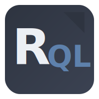

<h1 align="center">ResourceQL</h1>

<p align="center">
  
  <br>
  <em>A type-safe, composable abstraction layer <br /> 
  for document and collection APIs in TypeScript</em>
  <br>
</p>

<p align="center">
  <a href="https://ouijan.github.io/resource-ql/docs">Documentation</a>
  ·
  <a href="https://github.com/ouijan/resource-ql">Github Repo</a>
  <br>
  <br>
</p>

<p align="center">
  <a href="https://github.com/ouijan/resource-ql/actions/workflows/build.yml">
    
  </a>
  <a href="https://github.com/ouijan/resource-ql/actions/workflows/tests.yml">
    
  </a>
  <a href="https://ouijan.github.io/resource-ql/coverage/lcov-report">
    
  </a>
  <a href="https://ouijan.github.io/resource-ql/docs">
    
  </a>
</p>

<hr>
<br />

## Installation

Using npm:

```shell
$ npm i --save ouijan/resource-ql
```

In Typescript:

```typescript
import { NewResource, AdaptorTypes, IAdaptor, IDocResolver } from 'resource-ql';

// Set up an Adaptor
type MyAdaptorTypes = AdaptorTypes<
  MyDocRef,
  MyQueryRef,
  MyColRef,
  MyConstraint,
  MyTransaction
>;

class MyAdaptor implements IAdaptor<MyAdaptorTypes> {
  // Implement IAdaptor...
}

// Wrap your Adaptor
function getResource<T>(): IDocResolver<MyAdaptorTypes, T, T> {
  return NewResource<MyAdaptorTypes, T>(new MyAdaptor());
}

// Build Resources
const resource = getResource<IDocumentInterface>();
```

## Why ResourceQL?

ResourceQL enables you to compose and organize queries in one place, promoting
code reuse and maintainability. By separating query logic from business logic,
your data access code stays modular and easier to manage.

**Example:**

Suppose you want to fetch users with different filters. You can define base
queries and extend them as needed:

```typescript
class WorkspaceQuery {
  static resource = getResource<IWorkspace>();
  static users = this.resource.col<IUser>('users');
  static activeUsers = this.users.constraints(where('active', '==', true));
  static activeUsersByRole = this.activeUsers.constraintsWith((role: string) =>
    where('role', '==', role)
  );
}
```

Now, you can reuse and compose these queries anywhere in your application:

```typescript
const admins = await WorkspaceQuery.activeUsersByRole(
  workspaceRef,
  'admin'
).get();
const activeUsers = await WorkspaceQuery.activeUsers(workspaceRef).get();
```

This approach keeps queries DRY, maintainable, and reusable, while making
domain logic easier to test.

## Easier Testing

ResourceQL lets you easily stub or mock queries in tests. Since queries are
encapsulated, you can swap in test doubles without changing your domain logic.

Example:

Suppose you want to test `listActiveUserNames` without making real API calls:

```typescript
import { WorkspaceQuery } from '../queries/workspace';
import { listActiveUserNames } from '../services/userService';

jest.spyOn(WorkspaceQuery, 'activeUsers').mockResolvedValue({
  id: '123',
  name: 'Test User',
});

test('listActiveUserNames returns user data', async () => {
  const names = await listActiveUserNames(workspaceRef);
  expect(names).toEqual(['Test User']);
});
```

This keeps tests fast and reliable, ensuring domain logic is tested independently of data sources.

## Accessors

Accessors let you fetch data as either a `Promise` or an `Observable`, using the
same interface for both. This enables consistent, flexible, and reusable queries
throughout your app.

```typescript
const activeUsers = await WorkspaceQuery.activeUsers(workspaceRef).get();
const activeUsers$ = await WorkspaceQuery.activeUsers(workspaceRef).get$();
```

## Resolvers

Resolvers offer a structured way to access related documents or collections.
Starting with `NewResource`, you can easily fetch related data from a given
reference. This is ideal for projects with complex relationships, such as document
databases where documents reference each other.

**Example:**

Suppose you have a `User` document that references a `Workspace` document. You can
use resolvers to fetch related data easily:

```typescript
// Define your resource resolver
const userResolver = getResource<IUser>();

// Create a new resolver from the userResolver
const userWorkspaceResolver = userResolver.parent<IWorkspace>();

// Fetch the workspace data
const workspaceData = await userWorkspaceResolver(userRef).get();
```

This pattern makes it simple to traverse relationships and fetch nested or
related documents in a type-safe way.

## Adaptors

Backend adaptors provide a consistent interface for your app to interact with
any backend—REST APIs, databases, or custom services. This abstraction:

- Enables support for multiple or proprietary backends without changing core logic.
- Hides backend-specific details from your application code.
- Makes it easy to swap or update backends by modifying only the adaptor.
- Reduces code duplication and improves maintainability.

### Creating an Adaptor

ResourceQL does not include a built-in adaptor, allowing you to create
integrations tailored to your backend or platform. To set up an adaptor,
implement the `IAdaptor` interface using your preferred backend library.
See example adaptors here:

- [Custom Firestore wrapper](https://github.com/ouijan/resource-ql/blob/main/examples/custom-firestore/adaptor.ts)
- LokiJS (Work In Progress)
- Firestore with `firebase` (Work In Progress)
- Firestore with `firebase-admin` (Work In Progress)
